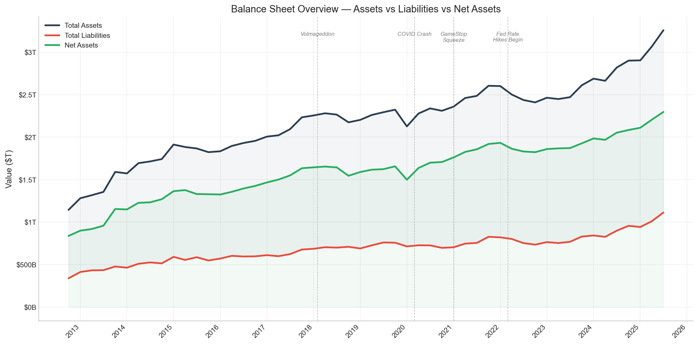

# Hedge Fund X-Ray

An open-source intelligence project reconstructing the U.S. hedge fund industry's financial anatomy from public regulatory data — balance sheets, derivatives, borrowing, positioning, and fund-level holdings — stitched together from sources no one combines.



## The Thesis

The hedge fund industry reports to a dozen different regulators in a dozen different formats. No single source tells the full story. But combined, they do.

This project pulls from **9 public data sources** across the Federal Reserve, SEC, CFTC, DTCC, and CBOE to build a unified picture of:

- **$12.6 trillion** in gross assets (Form PF) — 4x what the Fed reports
- **$20.2 trillion** in derivative exposure — 3.7x their net asset value
- **$415 trillion** in interest rate swap notional flowing through the system weekly
- **119,606 individual holdings** across 8 of the largest funds on earth
- The complete **borrowing, leverage, and counterparty structure** of an industry that answers to no single regulator

## Data Sources

| # | Source | What It Reveals | Coverage |
|---|--------|----------------|----------|
| 1 | **Federal Reserve Z.1** | Aggregate balance sheet (Table B.101.f) — assets, liabilities, net worth | 1945–2025, quarterly |
| 2 | **SEC Form PF** | Private fund statistics — GAV, NAV, leverage, derivatives, borrowing by creditor, strategy allocation, concentration | 2013–2025, quarterly + monthly |
| 3 | **CFTC Weekly Swaps** | OTC derivatives market — interest rate, credit, and FX swap notional, volumes, counterparty splits | 2013–2026, weekly |
| 4 | **SEC EDGAR 13F** | Fund-level equity and options holdings for Citadel, Bridgewater, Renaissance, Point72, Two Sigma, D.E. Shaw, Millennium, AQR | Per filing |
| 5 | **SEC EDGAR Submissions** | Complete filing history, SC 13G (5%+ ownership stakes), Form ADV registration | 1996–2026 |
| 6 | **CFTC COT** | Leveraged fund positioning in equity index futures | Weekly |
| 7 | **CBOE VIX** | Market volatility index | Daily, aggregated quarterly |
| 8 | **DTCC Swap Repository** | Trade-level OTC derivative transactions — 110 columns per trade including notional, counterparty type, clearing status, pricing | 2025–2026, daily |
| 9 | **CFTC FCM Financials** | Broker-level adjusted net capital, excess capital, customer segregated funds, cleared swap segregation | 2022–2026, monthly |

## What We've Found So Far

### The Industry Is 4x Larger Than Reported
The Fed's Z.1 shows $3.07T in hedge fund assets. SEC Form PF shows **$12.6T in gross assets** and **$20.2T in derivatives**. The difference is leverage and off-balance-sheet exposure that the Fed's flow-of-funds framework doesn't capture.

### Extreme Concentration
- Top 10 funds control **8.2%** of industry NAV
- Top 500 funds control **54.8%**
- Citadel alone reported **$1.55T** in 13F holdings — half the Fed's industry total
- Citadel filed **854 SC 13G forms** (5%+ ownership in 854 companies)

### The Borrowing Machine
- **78%** of hedge fund borrowing flows through prime brokerage
- Only **2.1%** is unsecured — the rest is collateralized
- **66.6%** of creditors are U.S. financial institutions; **31.8%** are non-U.S.
- Qualifying hedge funds hold **$2.6T in short repo** — the largest single funding source

### Leverage Is Mean-Reverting
Augmented Dickey-Fuller test (p=0.02) confirms the industry's leverage ratio is stationary — it oscillates around 0.43x and self-corrects. Peak was 0.48x in Q1 2020. This implies systemic deleveraging mechanisms are working, but also that leverage always rebuilds.

### The Derivatives Iceberg
- **$4.8T long / $4.9T short** in interest rate derivatives — nearly perfectly hedged
- **$1.8T long / $945B short** in equities — net long $883B
- **$517B long / $639B short** in credit — **net short $122B** (betting on defaults)
- The weekly CFTC swaps data shows **$415T** in IR notional outstanding — the plumbing beneath everything

### Stress Scenarios
| Scenario | Asset Impact | Leverage |
|----------|-------------|----------|
| Equity drawdown (-20%) | -8.2% | 0.46x → 0.52x |
| Interest rate shock (+200bp) | -1.7% | 0.46x → 0.50x |
| Prime brokerage pullback (-25%) | -5.2% | 0.46x → 0.41x |

### Cross-Source Statistical Tests

We run 18 hypothesis tests across all 9 data sources. Key findings:

| Test | Result | p-value | What It Means |
|------|--------|---------|---------------|
| **Liquidity mismatch vs VIX** | **PASS** | 0.005 | During market stress, investors can redeem faster than funds can liquidate — classic run risk |
| **VIX → leverage (Granger)** | **PASS** | 0.014 | Volatility *causes* leverage changes — fear drives deleveraging |
| **Z.1 leverage stationarity** | **PASS** | 0.026 | Industry leverage is mean-reverting around ~1.9x |
| **Form PF GAV trend** | **PASS** | 0.000 | Industry gross assets trending strongly upward |
| **Form PF GAV/NAV trend** | **PASS** | 0.000 | Leverage ratio trending upward — funds are levering up |
| **Z.1 ~ Form PF cointegration** | FAIL | 0.173 | The two measures of industry size move independently |
| **Z.1/Form PF ratio stability** | FAIL | 0.944 | The gap between Fed and SEC views of the industry is *widening* |
| **Form PF → Z.1 leverage** | FAIL | 0.086 | Borderline — SEC data nearly predicts Fed data at 10% level |

Full test results saved to `outputs/reports/cross_source_tests.csv`.

## Visualizations

16 publication-quality charts generated to `outputs/figures/`:

| Category | Charts |
|----------|--------|
| **Z.1 Balance Sheet** | Total assets, asset composition, debt securities, liability structure, balance sheet overview, derivative exposure, borrowing patterns, correlation heatmap |
| **Form PF** | GAV/NAV leverage, strategy allocation, concentration trends |
| **CFTC Swaps** | Clearing rates, notional outstanding |
| **FCM** | Capital & adequacy, market concentration |
| **Cross-Source** | Z.1 vs Form PF leverage comparison |

## Setup

```bash
pip install -r requirements.txt
echo "FRED_API_KEY=your_key_here" > .env
```

Get a free FRED API key at https://fred.stlouisfed.org/docs/api/api_key.html

## Usage

```bash
# Fetch all data (cached after first run)
python -m src.data.fetch

# Download CFTC weekly swap reports (~600 files, 2013–2026)
python -m src.data.fetch_swaps

# Download DTCC trade-level swap data (~1,825 files, 2025–2026)
python -m src.data.fetch_dtcc

# Download CFTC FCM financial reports (49 files, 2022–2026)
python -m src.data.fetch_fcm

# Parse all data sources into processed CSVs
python -m src.data.parse_form_pf    # 141 sheets → 19 CSVs
python -m src.data.parse_fcm        # 49 files → 5 CSVs
python -m src.data.parse_dtcc       # 1,310 ZIPs → 3 CSVs
python -m src.data.parse_swaps      # 302 files → 3 CSVs

# Run cross-source analysis (alignment, reconciliation, 18 hypothesis tests)
python -m src.analysis.cross_source

# Run the analysis notebook
jupyter notebook notebooks/hedge_fund_analysis.ipynb
```

## Project Structure

```
├── data/
│   ├── raw/
│   │   ├── swaps/              # ~600 weekly CFTC swap reports (xlsx)
│   │   ├── dtcc/               # Daily DTCC cumulative swap reports (zip/csv)
│   │   ├── fcm/                # Monthly FCM financial reports (xlsx)
│   │   ├── form_pf/            # SEC Form PF statistics (xlsx + pdf)
│   │   ├── form_adv/           # Fund profiles from EDGAR Submissions API
│   │   ├── 13f_*.csv           # Fund-level holdings
│   │   ├── cftc_cot.csv        # Futures positioning
│   │   └── vix_quarterly.csv   # Volatility index
│   └── processed/              # Cleaned, merged, derived datasets
├── src/
│   ├── data/
│   │   ├── fetch.py            # FRED, SEC EDGAR, CFTC, VIX fetchers
│   │   ├── fetch_swaps.py      # CFTC weekly swap report downloader
│   │   ├── fetch_dtcc.py       # DTCC trade-level swap data downloader
│   │   ├── fetch_fcm.py        # CFTC FCM financial report downloader
│   │   ├── parse_form_pf.py    # Form PF Excel parser (141 sheets → 19 CSVs)
│   │   ├── parse_fcm.py        # FCM financial report parser (49 files → 5 CSVs)
│   │   ├── parse_dtcc.py       # DTCC daily swap report parser (1,310 ZIPs → 3 CSVs)
│   │   ├── parse_swaps.py      # CFTC weekly swap report parser (302 files → 3 CSVs)
│   │   └── prepare.py          # Data cleaning and transformation
│   ├── analysis/
│   │   ├── metrics.py          # Derived metrics and statistics
│   │   └── cross_source.py     # Cross-source alignment, reconciliation, 18 hypothesis tests
│   └── visualization/
│       └── plots.py            # 18 matplotlib/seaborn chart functions
├── notebooks/
│   └── hedge_fund_analysis.ipynb
└── outputs/
    ├── figures/                # Generated charts
    └── reports/                # Executive summary, stress tests, stats
```

## Tech Stack

Python 3.10+ — pandas, numpy, matplotlib, seaborn, fredapi, openpyxl, requests, python-dotenv

## Processed Data

30 CSVs produced in `data/processed/` from the raw data:

| Source | Files | Key Outputs |
|--------|-------|-------------|
| Form PF | 19 | GAV/NAV, strategy allocation, concentration, leverage distribution, notional exposure, liquidity, fair value, geography, sector, borrowing, fund counts |
| FCM | 5 | Monthly industry totals, quarterly aggregates, top brokers, concentration (HHI) |
| DTCC | 3 | Daily summary, product breakdown, quarterly aggregates |
| CFTC Swaps | 3 | Weekly time series, long format, quarterly aggregates |
| Z.1 | 1 | Unified balance sheet with derived metrics |

## Status

**Active development.** All 9 data sources acquired and parsed. Cross-source analysis pipeline operational with 18 hypothesis tests. Next: decompose the derivatives black box and map the counterparty network.

## License & Citation

This project is licensed under [CC BY-SA 4.0](https://creativecommons.org/licenses/by-sa/4.0/).

**You must give appropriate credit if you use, remix, or build upon this work.** Derivatives must be shared under the same license.

### How to cite

```
Ortiz, C. (2026). Hedge Fund X-Ray: Reconstructing the U.S. hedge fund industry
from public regulatory data. https://github.com/Promeos/hedge-fund-xray
```

```bibtex
@misc{ortiz2026hedgefundxray,
  author = {Ortiz, Christopher},
  title = {Hedge Fund X-Ray},
  year = {2026},
  publisher = {GitHub},
  url = {https://github.com/Promeos/hedge-fund-xray}
}
```
